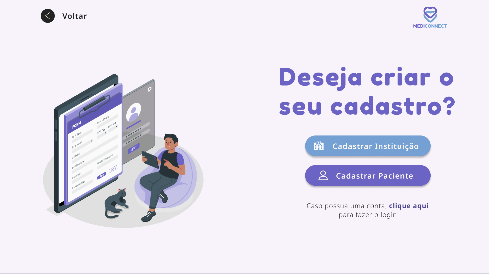

<h1 align = "center"> 🩺 Projeto MediConnect </h1>

 

Desenvolvido a partir do programa de capacitação full-stack ofertado pelo Serviço Nacional de Aprendizagem Comercial (SENAC), o Projeto MediConnect se propõe a abordar uma problemática corrente nos serviços de saúde, principalmente, àqueles oferecidos dentro do Sistema Único: a falta de adesão dos pacientes com suas consultas, cujo fundamental desenlace é a ausência dos mesmos em suas consultas de saúde (gerando o denominado absenteísmo).
 
Diante deste cenário, o objetivo do sistema MediConnect é implementar um modelo de envio de avisos para os usuários visando alertá-los sobre a pendência de suas consultas e das informações pertinentes destas que tendem a ser esquecidas pelos mesmos, como a data, horário e endereço do local. Todavia, o sistema realiza um calculo prévio ao envio desses avisos traçando um perfil de qual paciente é mais propenso a faltar, baseado em consultas prévias realizadas por este. Destarte, visando motivar o paciente e mostrar seu comprometimento com os tratamentos realizados, aplicou-se a ideia do que nos anos recentes designou-se como gamificação. Esta, consiste em uma abordagem tecnológica para realização de atividades, tarefas e comportamentos benéficos através do uso de características e mecanismos dos jogos, onde implementou-se selos e conquistas para os usuários visando promover e motivar o comportamento de comparecimento nas consultas de saúde.
  
Ademais, cabe elucidar as funcionalidades disponibilizadas pelo sistema MediConnect para as Instituições, Pacientes e Atendentes cadastrados.
 
Os usuários desfrutam de páginas personalizadas de acordo com suas necessidades. As Instituições podem cadastrar as especialidades de saúde que atendem e registrar os profissionais que dispõem em cada uma delas, bem como realizar o cadastro de seus atendentes. Estes, por sua vez, poderão acompanhar as consultas que estão em andamento na Instituição e realizar alterações nas mesmas quando preciso, como o registro de comparecimento ou ausência dos pacientes na unidade de saúde. Os Pacientes cadastrados poderão agendar ou cancelar suas consultas, receber notificações informando os dados das mesmas, acompanhar o andamento de suas consultas e verificar os selos em seus perfis.
  
Utilizar o sistema MediConnect traz vários benefícios, como praticidade, pontualidade e maior engajamento dos usuários com suas consultas. Venha conferir essa e outras possibilidades!

 

---

## Empresarial:

### 🎯 Missão

Transformar a relação das pessoas com consultas, trazendo mais praticidade e engajamento.

### 👁 Visão

Ser um sistema auxiliar para pessoas e instituições, reduzindo os índices de absenteísmo.

### 💎 Valores

Incentivo à saúde, ética, inovação e foco nas necessidades do público são nossos valores.

 

---

## ⚙ Tecnologias Utilizadas

O sistema MediConnect fora desenvolvido na linguagem de programação Java, dispondo da utilização do Jakarta Servlet, um componente do Java usado para estender as funcionalidades de um servidor. Para trabalhar com o banco de dados, utilizamos o Criteria API do Java, que nos permite trabalhar com queries sem manipular SQl (Structured Query Language) "natural".
  
Para o front-end, utilizamos das tecnologias básicas de HTML, CSS e Javascript, trabalhando também com Jakarta Server Pages (JSP) para criação dinâmica das páginas web.

 

---

## 📷 Preview do Sistema

O sistema permite ao usuário cadastrar-se como Paciente ou como Instituição

 

---

## 💻 Desenvolvedores:

> Antônio Lima - [Linkedin](#)
>
> Gabi Sofiati - [Linkedin](https://www.linkedin.com/in/gabi-sofiati-rausch?)
>
> Maicon Siebert - [Linkedin](https://www.linkedin.com/in/maicon-siebert-b16343281)
>
> Richard Domingues Nathan - [Linkedin](https://www.linkedin.com/in/richard-nathan-dev-full-stack/)
> 
> Robert Emanoel Young - [Linkedin](#)
> 
> Vitor Gabriel de Souza Delabenetta - [Linkedin](https://www.linkedin.com/in/gabriel-d-444a06181)
> 